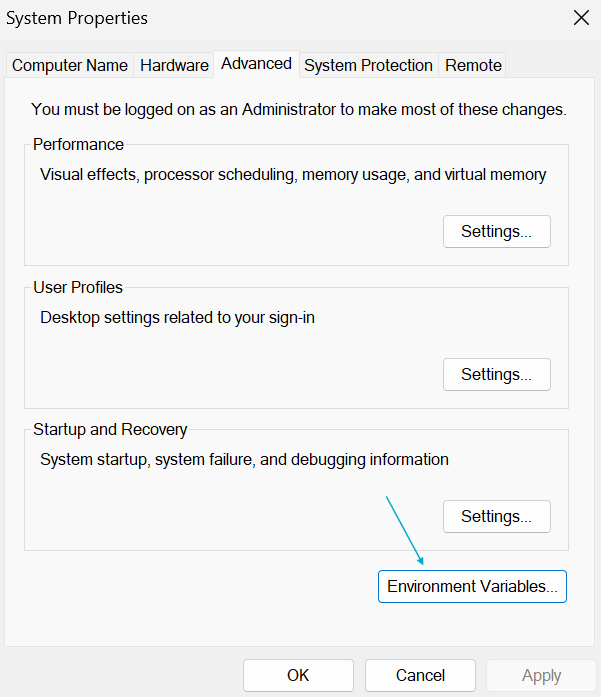
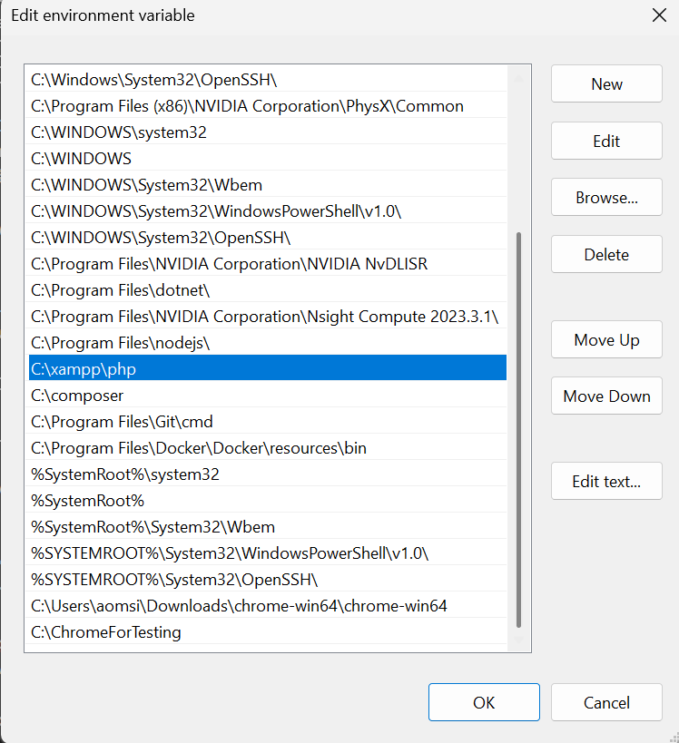
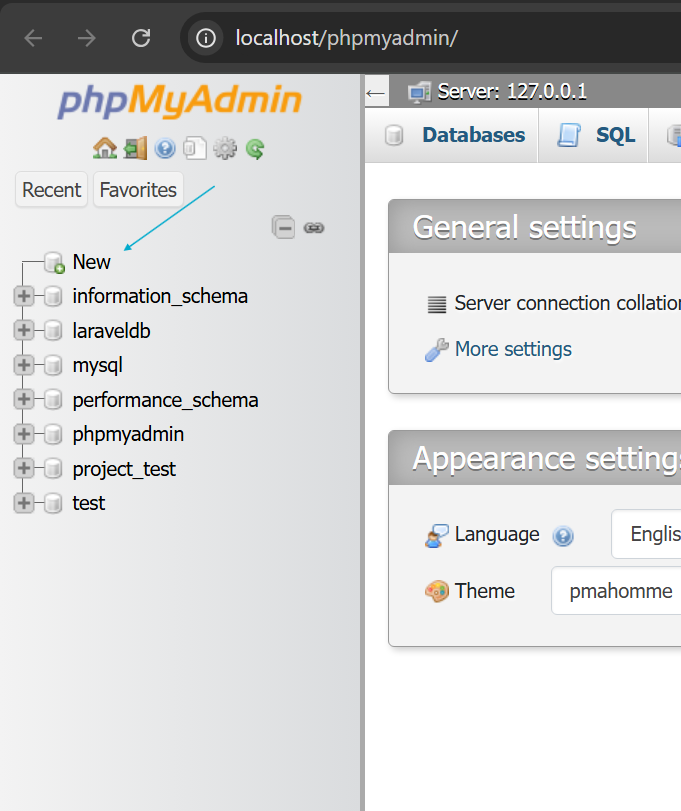
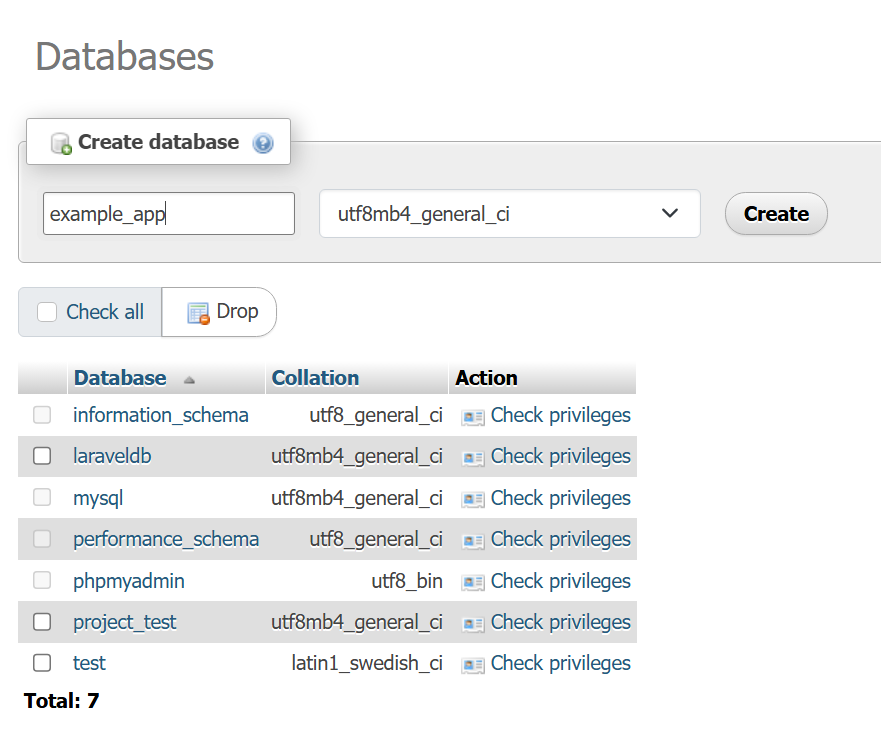
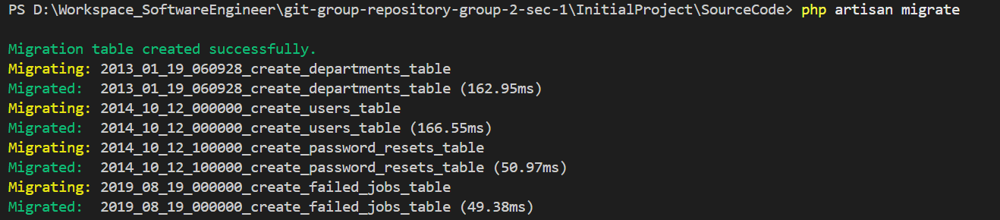
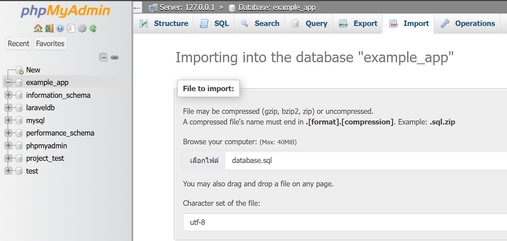

# การตั้งค่า XAMPP เพื่อใช้งาน PHP Laravel ในการพัฒนา Software

## 1. ดาวน์โหลดและติดตั้ง XAMPP
XAMPP เป็นซอฟต์แวร์ที่ช่วยจำลองเซิร์ฟเวอร์ Apache, PHP และ MySQL บนเครื่องของคุณ เพื่อให้สามารถพัฒนาแอปพลิเคชัน Laravel ได้ง่ายขึ้น

- ดาวน์โหลด XAMPP จาก [Apache Friends](https://www.apachefriends.org/index.html)
- ติดตั้งลงไปที่ `C:\xampp` เพื่อให้ง่ายต่อการเข้าถึงและการตั้งค่า
- เลือกเวอร์ชันที่รองรับกับ Laravel: 
  - Version 8.1.25 / PHP 8.1.25 หรือ 8.0.30 / PHP 8.0.30

### เพิ่ม PHP ใน Environment Variables
การเพิ่ม `C:\xampp\php` เข้าไปใน Environment Variables ช่วยให้สามารถรันคำสั่ง PHP ได้จากทุกที่ใน Command Line

1. เปิด `Edit the system environment variables`
2. ไปที่ `Environment Variables...`



3. เลือก `Path` แล้วกด `Edit...`


4. กด `New` แล้วเพิ่ม `C:\xampp\php`



5. กด `OK` เพื่อบันทึก

## 2. ติดตั้ง Composer
Composer เป็นตัวจัดการแพ็คเกจสำหรับ PHP ที่ช่วยให้เราสามารถติดตั้ง Laravel และไลบรารีอื่นๆ ได้ง่ายขึ้น

- ดาวน์โหลดและติดตั้ง Composer จาก [getcomposer.org](https://getcomposer.org/)
- ตรวจสอบการติดตั้งโดยใช้คำสั่ง:
  ```sh
  composer -V
  ```
  หากติดตั้งสำเร็จจะปรากฏเวอร์ชันของ Composer บนหน้าจอ


## 3. เปิดโปรเจค Laravel ที่มี Source Code อยู่แล้ว

### 3.1 Clone Repository
โค้ดอยู่บน GitHub สามารถใช้คำสั่ง:
```sh
  git clone [ลิงก์ repository ]
```
จากนั้นเข้าไปยังโฟลเดอร์โปรเจคด้วยคำสั่ง:
```sh
  cd [ไปที่ folder SourceCode ]
```

### 3.2 ติดตั้ง Dependencies
หลังจากเข้าไปที่โฟลเดอร์โปรเจคแล้ว ให้รันคำสั่ง:
```sh
  composer install
```
เพื่อดาวน์โหลดไลบรารีที่จำเป็นสำหรับ Laravel

### 3.3 ตั้งค่าไฟล์ `.env`
- คัดลอกไฟล์ `.env.example` แล้วเปลี่ยนชื่อเป็น `.env`
- แก้ไขค่าการเชื่อมต่อฐานข้อมูลตามที่ต้องการ

### 3.4 เปิด XAMPP และ Start Apache & MySQL
- เปิด XAMPP Control Panel
- กด `Start` ที่ Apache และ MySQL
- ตรวจสอบว่า MySQL ทำงานได้โดยไปที่ `localhost/phpmyadmin`
    - New Database Schema
      
    
  
    - สร้าง Database `example_app` ตามไฟล์ `.env`
      
    

### 3.5 ตั้งค่า Database และรัน Migration
- เปิด `phpMyAdmin` แล้วสร้างฐานข้อมูลใหม่ตามที่กำหนดใน `.env`
- รันคำสั่งสร้างคีย์แอปพลิเคชัน:
  ```sh
  php artisan key:generate
  ```
- รันคำสั่งเพื่อสร้างตารางในฐานข้อมูล:
  ```sh
  php artisan migrate
  ```

  
  
- Import ข้อมูลใน `phpMyAdmin` (ไฟล์ Database.sql ใน project)
  
  

### 3.6 เริ่มเซิร์ฟเวอร์ Laravel
รันคำสั่งต่อไปนี้เพื่อเปิดใช้งานเว็บเซิร์ฟเวอร์ของ Laravel:
```sh
  php artisan serve
```
จากนั้นเปิดเว็บเบราว์เซอร์แล้วเข้าไปที่ `http://127.0.0.1:8000` หรือ `localhost:8000`

---
✅ เท่านี้ก็สามารถใช้งาน Laravel ร่วมกับ XAMPP ได้แล้ว! 🎉
